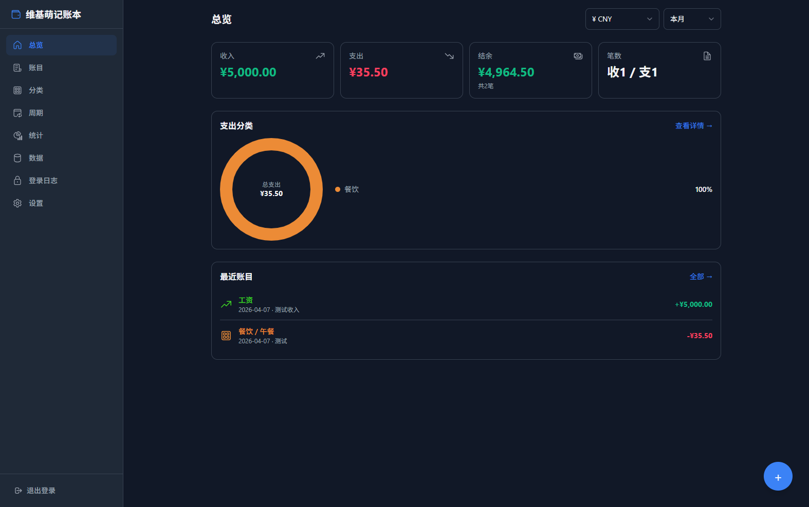

# 维基萌记账本

维基萌记账本是一个基于 Vue 3 和原生 Node.js HTTP 服务的轻量个人记账应用，支持账目管理、分类管理、周期规则、报表统计、数据导入导出和登录审计。

## 功能预览

### 登录

简洁的登录界面，支持"保持登录"选项。勾选后刷新 Token 有效期延长至一年，方便长期使用。


### 总览仪表盘

一目了然的财务概览：收入、支出、结余和笔数统计卡片，支出分类环形图，以及最近账目列表。支持按币种和时间范围快速筛选。



### 账目管理

完整的账目列表，支持按币种、类型、日期范围多维度筛选。自定义日历选择器替代原生控件，提供一致的跨平台体验。


### 记一笔

快速记账表单，支持选择收入/支出分类、输入金额、选择币种和日期、添加备注。分类以图标网格形式直观展示。


### 分类管理

两级分类结构（大类 + 子类），每个分类可自定义图标和颜色。支持支出和收入分类标签切换，灵活管理财务类目。


### 周期规则

设置自动记账规则，支持每天、每周、每月、每年四种频率。可配置执行时间、时区、开始/结束日期，实现无感自动记账。


### 统计报表

多维度统计分析：支持日、周、月、年四种周期切换，自定义日期导航器快速定位。环形图展示分类占比，趋势图追踪收支变化。


### 设置

个性化配置：支持亮色/暗色/跟随系统三种主题，可设置每周起始日和默认币种。


### 数据管理

数据导入导出功能：支持 JSON 和 CSV 格式导出，JSON 格式导入。方便数据备份和迁移。


### 登录日志

完整的登录审计日志，记录每次登录的时间、IP、用户名和结果（成功/失败），保障账户安全。


## 功能

- 账目新增、编辑、删除与按日期/类型筛选
- 收入/支出分类，两级分类结构
- 周期规则自动记账
- 日、周、月、年统计报表
- JSON/CSV 导出与 JSON 导入
- 登录限流与登录日志
- Docker 部署

## 技术栈

- 服务端：Node.js 24、原生 HTTP、Node SQLite
- 前端：Vue 3、Pinia、Vue Router、Vite、Tailwind CSS

## 本地运行

### 1. 准备环境

- Node.js 24+
- npm 10+

### 2. 配置环境变量

复制 .env.example 为 .env，并至少填写以下配置：

```env
ADMIN_USERNAME=admin
ADMIN_PASSWORD=请替换为强密码
ALLOWED_ORIGINS=http://localhost:3000,http://localhost:5173
DB_PATH=./data/bookkeeping.db
PORT=3000
BEHIND_CDN=false
```

JWT 签名密钥不再通过环境变量配置。服务首次启动时会自动生成 ./keys/jwt.key，后续重启会复用该文件；如需重置密钥，删除该文件后重新启动即可。

生产环境推荐使用 ADMIN_PASSWORD_HASH 替代明文密码。可用下面的命令生成 scrypt 哈希：

```bash
node --input-type=module -e "import { hashPassword } from './server/src/auth/password.js'; console.log(hashPassword('请替换为强密码'))"
```

生成后把结果填入 .env：

```env
ADMIN_USERNAME=admin
ADMIN_PASSWORD=
ADMIN_PASSWORD_HASH=scrypt$...$...
```

### 3. 安装依赖并构建前端

```bash
cd web
npm install
cd ..
npm run build
```

### 4. 启动应用

```bash
npm start
```

打开 http://localhost:3000。

## 开发模式

服务端：

```bash
npm run dev:server
```

前端：

```bash
cd web
npm run dev
```

Vite 开发服务器默认运行在 http://localhost:5173，并代理 /api 到 http://localhost:3000。

## Docker

Docker 镜像不再在容器内编译前端，而是直接使用仓库中的 web/dist 产物。

先在本地构建前端：

```bash
npm run build
```

然后构建并启动：

```bash
docker compose up -d --build
```

容器默认读取根目录 .env，数据保存在 data 目录，JWT 密钥保存在 keys/jwt.key 并通过 docker-compose 持久化。更新前端代码后，需要重新执行一次本地构建，让最新的 web/dist 一并进入镜像。

## 安全说明

- .env、data、node_modules、构建产物都已通过 .gitignore 排除，不应提交到仓库。
- JWT 签名密钥会在首次启动时自动生成到 keys/jwt.key；如果文件为空、损坏或长度不足，服务会拒绝启动。
- 容器生产模式下会拒绝弱默认密码。
- 默认只允许本机来源访问 API；如有反向代理或独立前端域名，请配置 ALLOWED_ORIGINS。
- 前端图标统一使用内置 Fluent SVG 白名单资源，不接受用户输入的 SVG 或 HTML。
- 导入接口增加了数据结构、日期、数值和数量上限校验。

## 常用命令

```bash
# 构建前端
npm run build

# 启动服务
npm start

# 服务端热重载
npm run dev:server
```
