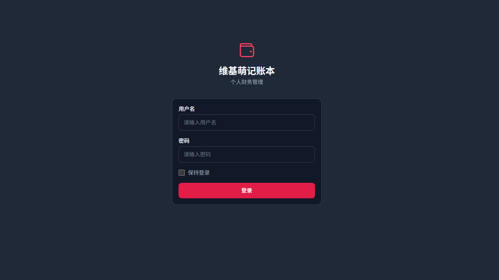
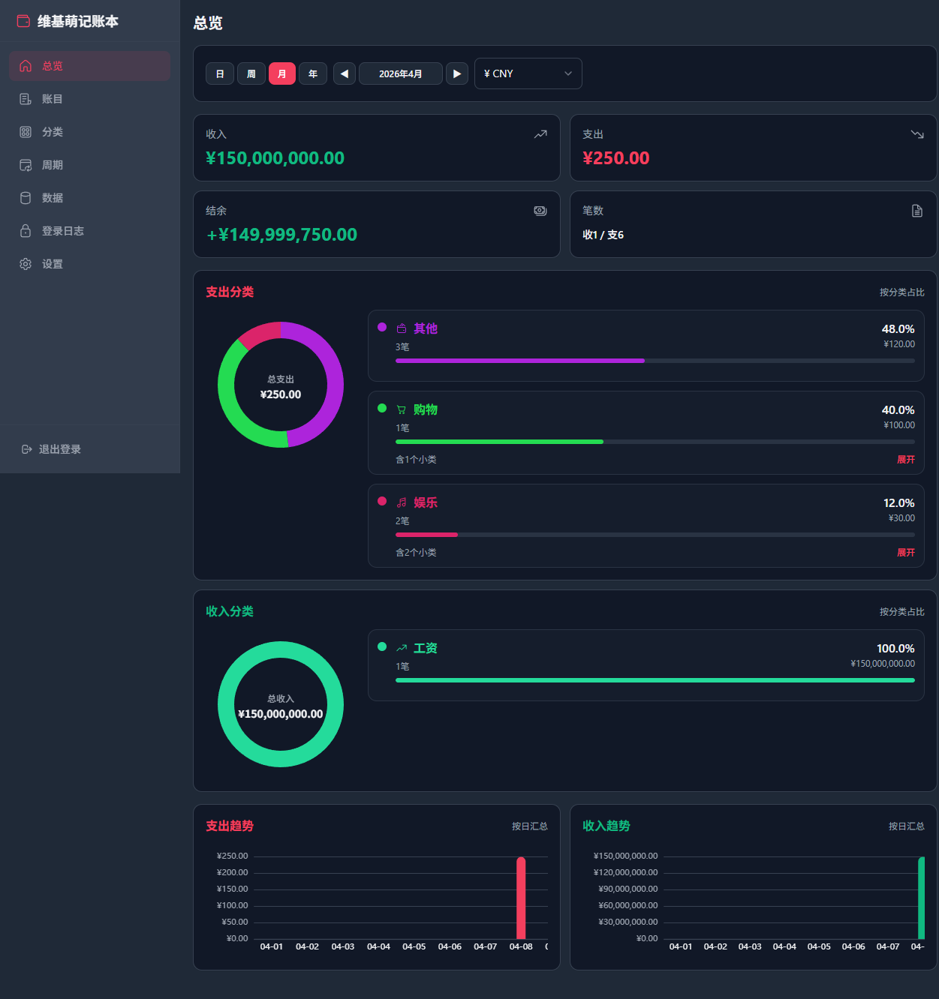
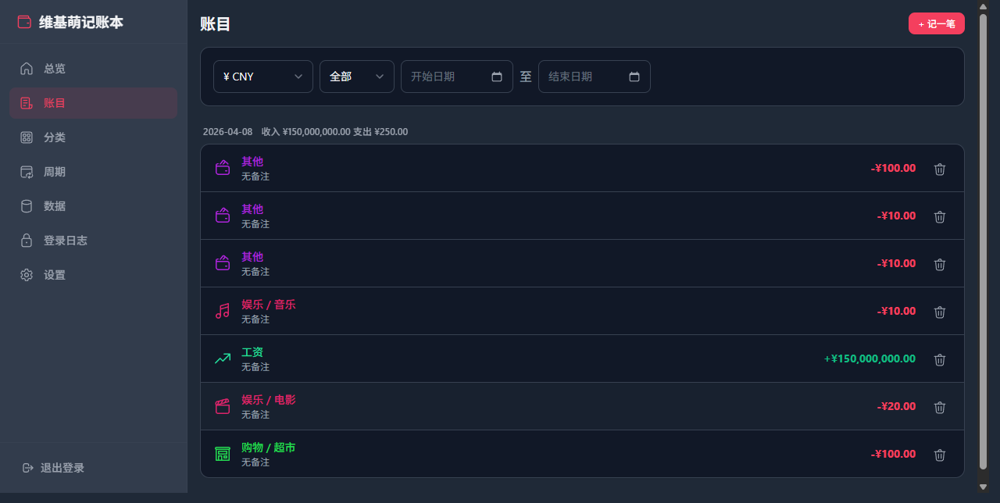
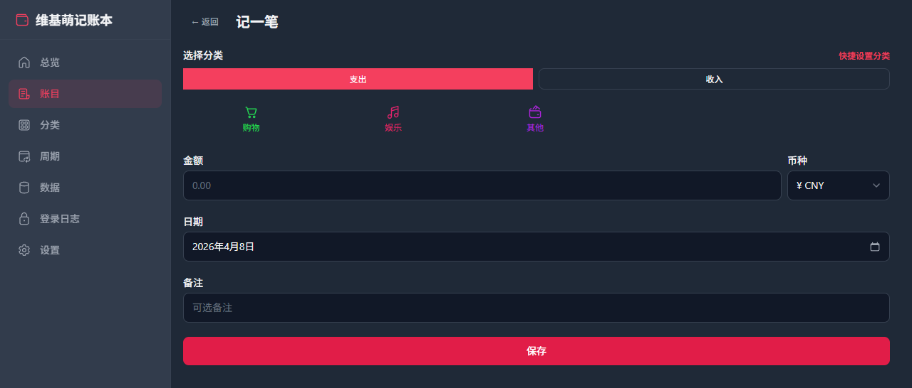
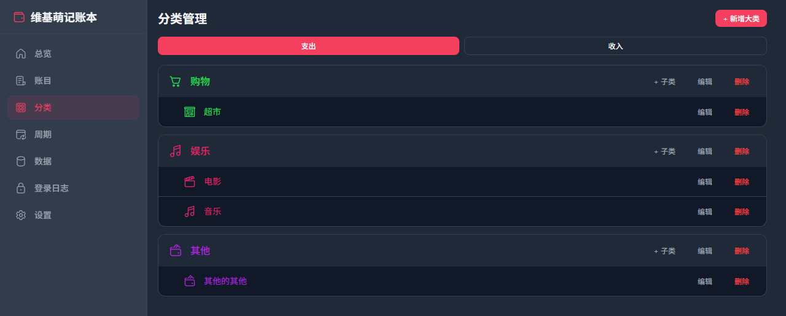
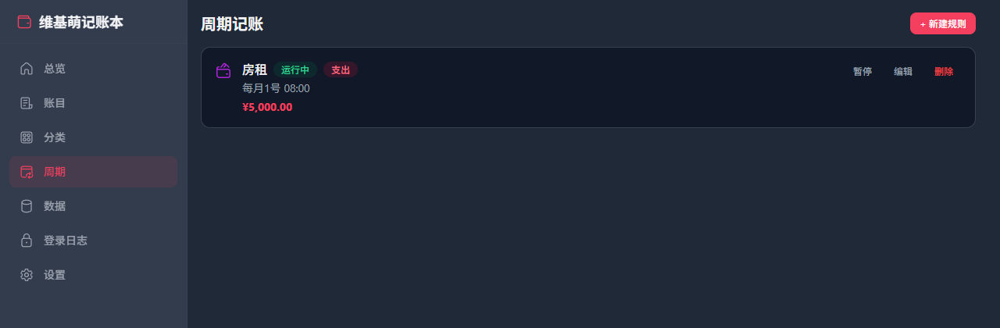
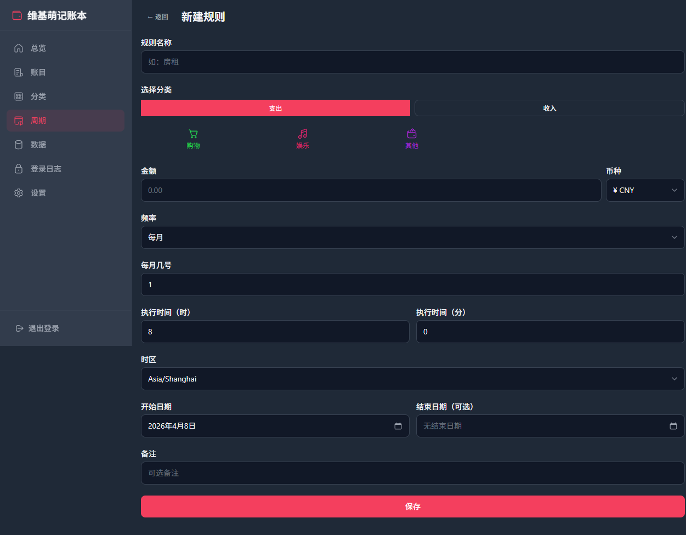
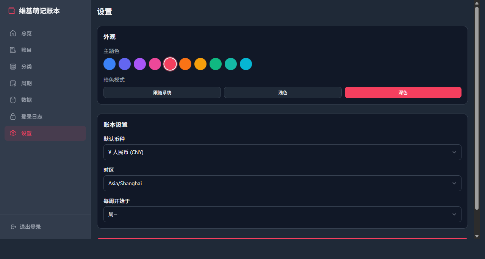
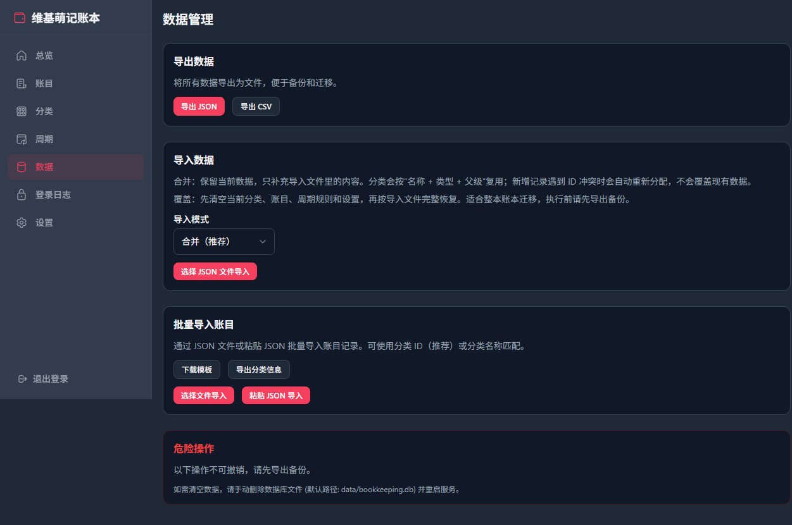
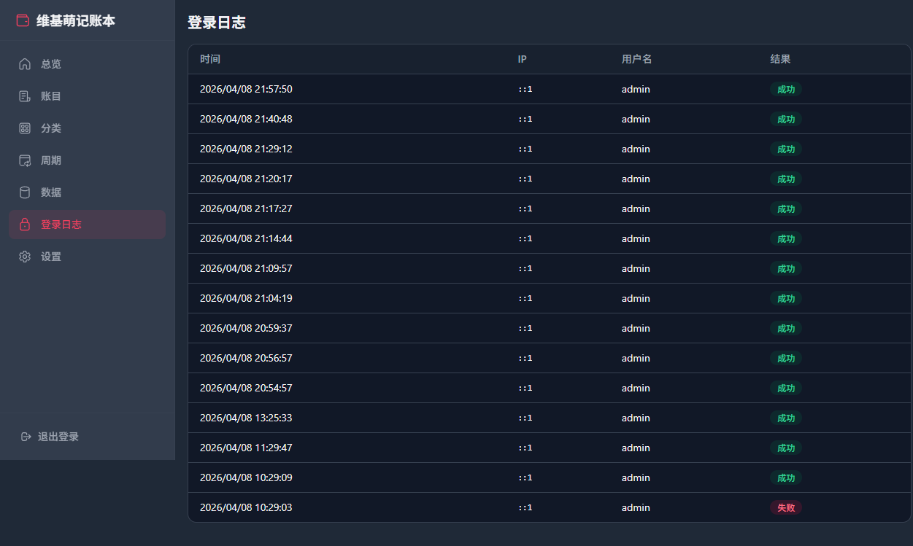

# 维基萌记账本

维基萌记账本是一个基于 Vue 3 和原生 Node.js HTTP 服务的个人记账应用，覆盖登录认证、总览统计、账目录入、分类维护、周期记账、数据备份和登录审计。桌面端提供侧边栏导航，移动端提供底部导航，适合个人自部署使用。

## 页面预览

### 登录

简洁的登录界面，支持"保持登录"选项。勾选后刷新 Token 有效期延长至一年，方便长期使用。



### 总览与报表

当前首页同时承担总览和报表入口，集成日/周/月/年切换、时间导航、币种筛选、收支统计卡片、分类占比图和趋势图，适合快速查看当前账本状态。



### 账目管理

账目列表按日期分组展示，支持按币种、收支类型和开始/结束日期组合筛选。每条记录展示分类、备注、金额和来源标签，便于区分手动录入、批量导入和周期生成的数据。



### 记一笔

新增与编辑账目共用同一套表单，支持切换收入/支出分类、录入金额、币种、日期和备注，也支持在录入过程中快捷补充分类。



### 分类管理

分类采用大类加子类的两级结构，收入与支出分开管理。每个大类可自定义图标和颜色，支持继续追加子类、编辑和删除。



### 周期规则

周期规则列表集中展示所有自动记账任务，可查看频率、分类、金额和启用状态，并直接执行启停、编辑和删除操作。



### 新建规则

规则表单支持每天、每周、每月、每年四种频率，可配置分类、金额、币种、开始执行时间，以及按周/按月/按年所需的周期字段。



### 设置

设置页负责账本外观与基础偏好配置，支持主题色、暗色模式、默认币种、时区和每周起始日。



### 数据管理

数据管理页提供导入导出能力，支持 JSON 和 CSV 导出、JSON 导入，并区分合并导入与覆盖导入，适合做备份、迁移和批量恢复。



### 登录日志

登录日志记录每次登录的时间、IP、用户名和结果，可直接用于审计账号访问情况和排查异常登录。



## 功能

- 总览与报表：支持日、周、月、年周期切换，查看收支、结余、笔数、分类占比和趋势图
- 账目管理：支持账目新增、编辑、删除，以及按币种、类型、日期范围筛选
- 分类体系：支持收入/支出双通道分类、大类/子类结构、图标和颜色管理
- 周期记账：支持每天、每周、每月、每年自动记账规则及启停管理
- 个性化设置：支持主题色、暗色模式、默认币种、时区、周起始日
- 数据管理：支持 JSON/CSV 导出、JSON 导入、合并与覆盖恢复
- 安全审计：支持登录限流、Refresh Token 续期和登录日志记录
- 部署方式：支持本地运行与 Docker 部署

## 技术栈

- 服务端：Node.js 24、原生 HTTP、Node SQLite
- 前端：Vue 3、Pinia、Vue Router、Vite、Tailwind CSS

## 本地运行

### 1. 准备环境

- Node.js 24+
- npm 10+

### 2. 配置环境变量

复制 .env.example 为 .env，并至少填写以下配置：

```env
ADMIN_USERNAME=admin
ADMIN_PASSWORD=请替换为强密码
ALLOWED_ORIGINS=http://localhost:3000,http://localhost:5173
DB_PATH=./data/bookkeeping.db
PORT=3000
BEHIND_CDN=false
```

JWT 签名密钥不再通过环境变量配置。服务首次启动时会自动生成 ./keys/jwt.key，后续重启会复用该文件；如需重置密钥，删除该文件后重新启动即可。

生产环境推荐使用 ADMIN_PASSWORD_HASH 替代明文密码。可用下面的命令生成 scrypt 哈希：

```bash
node --input-type=module -e "import { hashPassword } from './server/src/auth/password.js'; console.log(hashPassword('请替换为强密码'))"
```

生成后把结果填入 .env：

```env
ADMIN_USERNAME=admin
ADMIN_PASSWORD=
ADMIN_PASSWORD_HASH=scrypt$...$...
```

### 3. 安装依赖并构建前端

```bash
cd web
npm install
cd ..
npm run build
```

### 4. 启动应用

```bash
npm start
```

打开 http://localhost:3000。

## 开发模式

服务端：

```bash
npm run dev:server
```

前端：

```bash
cd web
npm run dev
```

Vite 开发服务器默认运行在 http://localhost:5173，并代理 /api 到 http://localhost:3000。

## Docker

Docker 镜像不再在容器内编译前端，而是直接使用仓库中的 web/dist 产物；运行时基础镜像固定为 Node 24。

先在本地构建前端：

```bash
npm run build
```

然后构建并启动：

```bash
docker compose up -d --build
```

容器默认读取根目录 .env，数据保存在 data 目录，JWT 密钥保存在 keys/jwt.key 并通过 docker-compose 持久化。更新前端代码后，需要重新执行一次本地构建，让最新的 web/dist 一并进入镜像。

## 安全说明

- .env、data、node_modules、构建产物都已通过 .gitignore 排除，不应提交到仓库。
- JWT 签名密钥会在首次启动时自动生成到 keys/jwt.key；如果文件为空、损坏或长度不足，服务会拒绝启动。
- 容器生产模式下会拒绝弱默认密码。
- 默认只允许本机来源访问 API；如有反向代理或独立前端域名，请配置 ALLOWED_ORIGINS。
- 前端图标统一使用内置 Fluent SVG 白名单资源，不接受用户输入的 SVG 或 HTML。
- 导入接口增加了数据结构、日期、数值和数量上限校验。

## 常用命令

```bash
# 构建前端
npm run build

# 启动服务
npm start

# 服务端热重载
npm run dev:server
```
